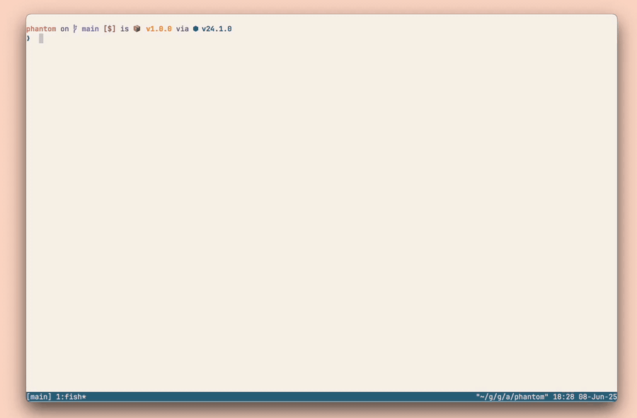
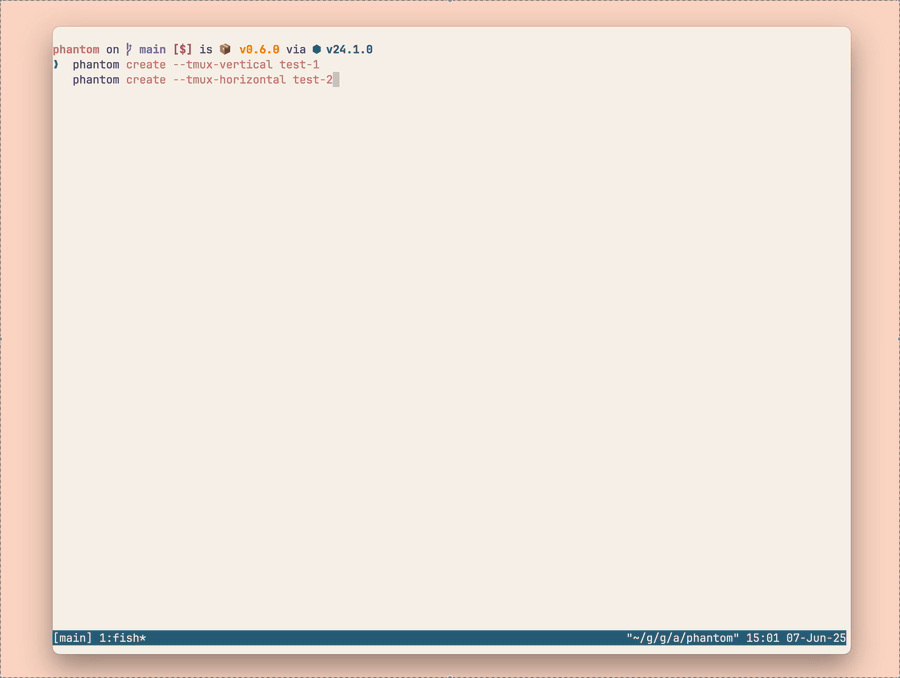
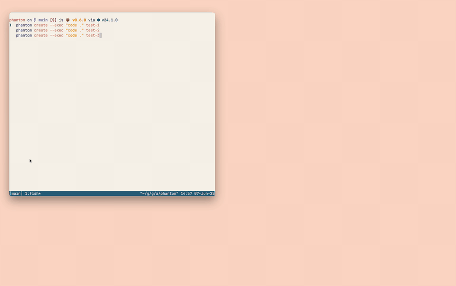

# 👻 Phantom

<div align="center">

**Git worktreeを使ったシームレスな並行開発のためのパワフルなCLIツール**

[](https://www.npmjs.com/package/@aku11i/phantom)
[](https://opensource.org/licenses/MIT)
[](https://nodejs.org)
[](https://deepwiki.com/aku11i/phantom)

[English](./README.md) • [インストール](#-インストール) • [なぜPhantom？](#-なぜphantom) • [基本的な使い方](#-基本的な使い方) • [ドキュメント](#-ドキュメント)



</div>

## ✨ Phantomとは？

PhantomはGit worktreeをシンプルかつパワフルに操り、開発生産性を飛躍的に向上させるCLIツールです。複数のタスクを独立した作業環境で同時進行し、真のマルチタスク開発を実現します。AIエージェントを用いた並行開発に対応した次世代の並行開発ツールです。

### 主な機能

- 🚀 **シンプルなWorktree管理** - 直感的なコマンドでGit worktreeを作成・管理
- 🔄 **真のマルチタスク** - ブランチ毎に作業ディレクトリを作成し、複数のタスクを同時進行
- 🎯 **どこからでもコマンド実行** - `phantom exec <worktree> <command>`でワークツリーに対してコマンドを実行可能
- 🪟 **組み込みtmux統合** - ワークツリーを新しいペインやウィンドウで開きます
- 🔍 **fzfによるインタラクティブな選択** - worktreeの選択に組み込みのfzfオプションを使用できます
- 🎮 **シェル補完** - FishとZshの完全な自動補完サポート
- ⚡ **ゼロ依存** - 高速で軽量

## 🚀 インストール

### Homebrewを使用（推奨）

```bash
brew install aku11i/tap/phantom
```

#### npmを使用

```bash
npm install -g @aku11i/phantom
```

## 🤔 なぜPhantom？

Git worktreeは強力ですが、パスとブランチの手動管理が必要です。また、複数のワークツリーを移動するのも大変です。Phantomはこの問題を解消します：

```bash
# Phantomなし
git worktree add -b feature-awesome ../project-feature-awesome origin/main
cd ../project-feature-awesome

# Phantomあり
phantom create feature-awesome --shell
```

### Phantomの仕組み

`phantom create feature-awesome`を実行すると、`.git/phantom/worktrees/`に`feature-awesome`という名前の新しいGit worktreeが作成されます。
phantomを使って作成されたすべてのワークツリーがこの場所で一元管理されます

```
your-project/    # Gitリポジトリ
├── .git/
│   └── phantom/
│       └── worktrees/        # Phantomが管理するディレクトリ
│           ├── feature-awesome/  # ブランチ名 = worktree名
│           ├── bugfix-login/     # 別のworktree
│           └── hotfix-critical/  # さらに別のworktree
└── ...
```

このルールにより、worktreeの場所を覚える必要がなくなり、ブランチ名だけで簡単にワークツリーの操作ができます。

### ✈️ 快適な開発体験を実現する機能

Phantomはコマンドラインツールとしての完璧な機能を備えています。開発者はまるでファーストクラスに乗っているような信頼と安心を感じます。

#### シェル補完

Phantomはfishとzshの完全なシェル補完をサポートしています。タブキーでコマンドやworktree名を補完できます。

#### tmux統合

ワークツリーを作成する際にtmuxを使用して新しいウィンドウやペインで開くことができます。これにより、複数の作業環境を同時に管理できます。

```bash
# 新しいウィンドウでworktreeを作成して開く
phantom create feature-x --tmux
# ペインを分割して作成
phantom create feature-y --tmux-vertical
phantom create feature-z --tmux-horizontal

# 既存のworktreeをtmuxで開く
phantom shell feature-x --tmux
phantom shell feature-y --tmux-v

# 結果: 複数のworktreeが同時に表示され、それぞれで独立した作業が可能
```



#### エディタ統合

PhantomはVS CodeやCursorなどのエディタでも快適に使用できます。エディタを指定してワークツリーを開くことができます。

```bash
# VS Codeで開く
phantom create feature --exec "code ."

# または既存のworktreeを開く
phantom exec feature code .

# Cursorで開く
phantom create feature --exec "cursor ."
phantom exec feature cursor .
```



#### fzf統合

fzfを使用したインタラクティブな検索で素早くworktreeを選択できます。

```bash
# fzfでworktreeを選択してシェルを開く
phantom shell --fzf

# fzfでworktreeを選択して削除
phantom delete --fzf
```

## 🔍 基本的な使い方

### 新しいワークツリーの作成

```bash
phantom create feature-awesome

phantom list
```

### worktreeで新しいシェルを起動

```bash
phantom shell feature-awesome

# 開発作業を開始

# 作業が終わったらシェルを終了
exit
```

### 任意のworktreeでコマンドを実行

```bash
phantom exec feature-awesome {実行したいコマンド}
# 例: phantom exec feature-awesome npm run build
```

### 完了したらクリーンアップ

```bash
phantom delete feature-awesome
```


## 📚 ドキュメント

- **[はじめに](./docs/getting-started.md)** - 一般的なワークフローとヒント
- **[コマンドリファレンス](./docs/commands.md)** - すべてのコマンドとオプション
- **[設定](./docs/configuration.md)** - 自動ファイルコピーと作成後コマンドの設定


## 🤝 コントリビュート

コントリビュートは歓迎します！[コントリビューションガイド](./CONTRIBUTING.md)をご覧ください：
- 開発環境のセットアップ
- コードスタイルガイドライン
- テスト要件
- プルリクエストプロセス

## 📄 ライセンス

MIT License - [LICENSE](LICENSE)を参照

## 🙏 謝辞

👻 [@aku11i](https://github.com/aku11i)と[Claude](https://claude.ai)によって作られました
