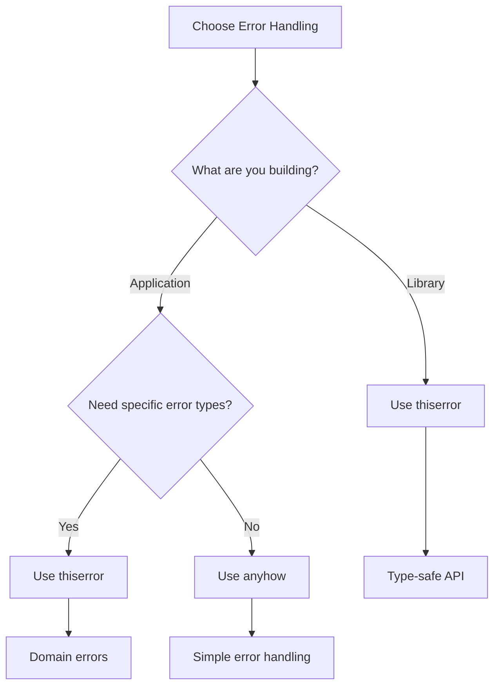
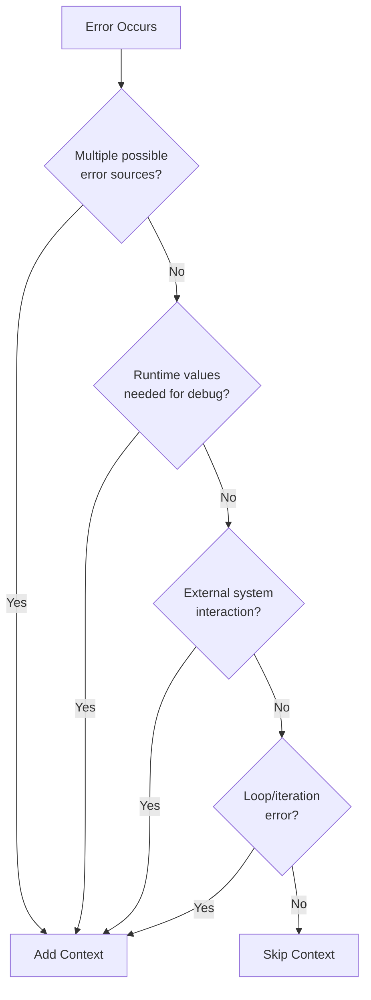

# Rust Error Handling Guidelines
## A Practical Guide to Adopting thiserror and anyhow

### Table of Contents
1. [Introduction](#introduction)
2. [Current Problems and Why Change](#current-problems-and-why-change)
3. [Understanding thiserror and anyhow](#understanding-thiserror-and-anyhow)
4. [Practical Adoption Strategy](#practical-adoption-strategy)
5. [When to Add Error Context](#when-to-add-error-context)
6. [Migration Examples](#migration-examples)
7. [Best Practices and Anti-patterns](#best-practices-and-anti-patterns)
8. [Team Adoption Guidelines](#team-adoption-guidelines)
9. [Quick Reference](#quick-reference)

---

## Introduction

This guide provides practical advice for teams looking to improve error handling in existing Rust codebases by adopting `thiserror` and `anyhow`. Rather than prescribing a one-size-fits-all approach, it offers flexible strategies that can be adapted to your specific needs.

### Who This Guide Is For
- Engineers working with Rust codebases that have inconsistent error handling
- Tech leads wanting to standardize error handling practices
- Developers looking to reduce boilerplate in error management

### Core Principle
Start small, measure impact, and expand gradually. Avoid changing everything at once.

---

## Current Problems and Why Change

### Common Anti-patterns in Rust Error Handling

#### 1. String-based Errors
```rust
// ❌ Problems: Loss of type information, difficult to match on errors
fn process_file(path: &str) -> Result<String, String> {
    let content = std::fs::read_to_string(path)
        .map_err(|e| format!("Failed to read file: {}", e))?;
    
    if content.is_empty() {
        return Err("File is empty".to_string());
    }
    
    Ok(content)
}
```

#### 2. Overly Complex Custom Errors
```rust
// ❌ Problems: Too much boilerplate, maintenance burden
#[derive(Debug)]
pub enum MyError {
    Io(std::io::Error),
    Parse(serde_json::Error),
    Custom(String),
}

impl std::fmt::Display for MyError {
    fn fmt(&self, f: &mut std::fmt::Formatter<'_>) -> std::fmt::Result {
        match self {
            MyError::Io(e) => write!(f, "IO error: {}", e),
            MyError::Parse(e) => write!(f, "Parse error: {}", e),
            MyError::Custom(s) => write!(f, "{}", s),
        }
    }
}

impl std::error::Error for MyError {}

// Plus all the From implementations...
```

### Impact of These Problems
- **Slower debugging**: Unclear error sources and limited context
- **Inconsistent handling**: Different error approaches across the codebase
- **Development friction**: Time spent writing error boilerplate

---

## Understanding thiserror and anyhow

### Clear Separation of Concerns



### When to Use Each

**Use `thiserror` when:**
- Building a library that others will use
- Defining domain-specific errors
- Callers need to match on specific error types
- Creating errors at module boundaries

**Use `anyhow` when:**
- Building application-level code
- Error type doesn't matter, only the message
- Prototyping or iterating quickly
- Integrating multiple libraries with different error types

---

## Practical Adoption Strategy

### Start Small and Iterate

Instead of a comprehensive migration plan, follow this approach:

1. **Identify Pain Points** (1 day)
   - Find the most problematic error handling in your code
   - Look for areas with frequent error-related bugs
   - Start with just one module or component

2. **Pilot Implementation** (1 week)
   - Add dependencies to `Cargo.toml`:
     ```toml
     [dependencies]
     thiserror = "1.0"
     anyhow = "1.0"
     ```
   - Implement in one small area
   - Gather team feedback

3. **Gradual Expansion** (ongoing)
   - Apply to new code first
   - Refactor existing code only when touching it for other reasons
   - No need to migrate everything

### Measuring Success

Instead of rigid metrics, look for:
- Reduced time spent debugging error-related issues
- Positive feedback from developers
- Clearer error messages in logs

---

## When to Add Error Context

### Specific Criteria for Adding Context

#### ✅ Add Context When:

**1. Multiple Error Sources**
```rust
// Context needed: Same error type from different operations
fn process_user_data(user_id: u64) -> Result<()> {
    let profile = db.get_profile(user_id)
        .context("Failed to fetch user profile")?;
    
    let settings = db.get_settings(user_id)
        .context("Failed to fetch user settings")?;
    
    Ok(())
}
```

**2. Runtime Values Matter**
```rust
// Context needed: Dynamic values help debugging
fn connect_to_service(host: &str, port: u16) -> Result<Connection> {
    establish_connection(host, port)
        .with_context(|| format!("Failed to connect to {}:{}", host, port))
}
```

**3. External System Boundaries**
```rust
// Context needed: External API calls
async fn fetch_data(endpoint: &str) -> Result<Data> {
    client.get(endpoint)
        .send()
        .await
        .with_context(|| format!("Failed to fetch from endpoint: {}", endpoint))?
        .json()
        .await
        .context("Failed to parse API response")
}
```

**4. Loop Iterations**
```rust
// Context needed: Identify which iteration failed
for (index, record) in records.iter().enumerate() {
    process_record(record)
        .with_context(|| format!("Failed at record {}", index))?;
}
```

#### ❌ Skip Context When:

**1. Error Source is Obvious**
```rust
// No context needed: Function name is clear
fn read_config() -> Result<Config> {
    let content = fs::read_to_string("config.json")?;
    Ok(serde_json::from_str(&content)?)
}
```

**2. Internal Simple Functions**
```rust
// No context needed: Simple internal operation
fn calculate_total(items: &[Item]) -> Result<f64> {
    validate_items(items)?;
    Ok(items.iter().map(|i| i.price).sum())
}
```

### Decision Flow



---

## Migration Examples

### Example 1: From String Errors to Typed Errors

**Before:**
```rust
fn validate_user(user: &User) -> Result<(), String> {
    if user.email.is_empty() {
        return Err("Email is required".to_string());
    }
    if user.age < 18 {
        return Err("User must be 18 or older".to_string());
    }
    Ok(())
}
```

**After with thiserror:**
```rust
use thiserror::Error;

#[derive(Error, Debug)]
pub enum ValidationError {
    #[error("Email is required")]
    MissingEmail,
    
    #[error("User must be 18 or older (age: {age})")]
    UnderAge { age: u32 },
}

fn validate_user(user: &User) -> Result<(), ValidationError> {
    if user.email.is_empty() {
        return Err(ValidationError::MissingEmail);
    }
    if user.age < 18 {
        return Err(ValidationError::UnderAge { age: user.age });
    }
    Ok(())
}
```

### Example 2: Simplifying Application Errors

**Before:**
```rust
fn load_and_process_data(path: &str) -> Result<ProcessedData, Box<dyn Error>> {
    let content = fs::read_to_string(path)?;
    let parsed: RawData = serde_json::from_str(&content)?;
    let processed = process_data(parsed)?;
    Ok(processed)
}
```

**After with anyhow:**
```rust
use anyhow::{Context, Result};

fn load_and_process_data(path: &str) -> Result<ProcessedData> {
    let content = fs::read_to_string(path)
        .with_context(|| format!("Failed to read file: {}", path))?;
    
    let parsed: RawData = serde_json::from_str(&content)
        .context("Invalid JSON format")?;
    
    let processed = process_data(parsed)
        .context("Data processing failed")?;
    
    Ok(processed)
}
```

### Example 3: Library and Application Boundary

```rust
// Library code (using thiserror)
mod database {
    use thiserror::Error;
    
    #[derive(Error, Debug)]
    pub enum DbError {
        #[error("Connection failed: {reason}")]
        ConnectionFailed { reason: String },
        
        #[error("Query failed: {query}")]
        QueryFailed { query: String },
    }
    
    pub fn execute_query(query: &str) -> Result<Vec<Row>, DbError> {
        // Implementation
    }
}

// Application code (using anyhow)
use anyhow::{Context, Result};

fn get_user_data(user_id: u64) -> Result<UserData> {
    let query = format!("SELECT * FROM users WHERE id = {}", user_id);
    
    let rows = database::execute_query(&query)
        .with_context(|| format!("Failed to fetch user {}", user_id))?;
    
    parse_user_data(rows)
        .context("Failed to parse user data")
}
```

---

## Best Practices and Anti-patterns

### ✅ Best Practices

**1. Appropriate Error Granularity**
```rust
#[derive(Error, Debug)]
pub enum ConfigError {
    #[error("File not found: {path}")]
    NotFound { path: PathBuf },
    
    #[error("Invalid format at line {line}")]
    InvalidFormat { line: usize },
}
// Good: Specific enough to be useful, not overly detailed
```

**2. Contextual Information Without Overdoing It**
```rust
// Add context only when it adds value
database_operation()
    .with_context(|| format!("Failed to update user {}", user_id))?;

// Skip context when obvious
simple_calculation()?;  // Function name is self-explanatory
```

**3. Error Recovery Patterns**
```rust
match risky_operation() {
    Ok(value) => process_value(value),
    Err(e) if is_recoverable(&e) => {
        log::warn!("Recoverable error: {}, using default", e);
        process_value(default_value())
    }
    Err(e) => return Err(e.into()),
}
```

### ❌ Anti-patterns to Avoid

**1. Losing Error Information**
```rust
// Bad: Original error context lost
something().map_err(|_| "Operation failed")?;

// Good: Preserve error chain
something().context("Operation failed")?;
```

**2. Overly Generic Errors**
```rust
// Bad: Too vague
#[derive(Error, Debug)]
enum Error {
    #[error("Something went wrong")]
    Generic,
}

// Good: Specific and actionable
#[derive(Error, Debug)]
enum Error {
    #[error("Database connection timeout after {seconds}s")]
    Timeout { seconds: u64 },
}
```

**3. Premature Error Standardization**
```rust
// Bad: Forcing all errors into rigid format too early
// Instead: Let patterns emerge naturally, then standardize
```

---

## Team Adoption Guidelines

### Flexible Implementation Approach

#### For Small Teams (< 10 developers)
- Start with new features only
- Let adoption happen organically
- Focus on education through code reviews

#### For Medium Teams (10-50 developers)
- Begin with a pilot team or component
- Document patterns that work well
- Gradually expand based on success

#### For Large Teams (50+ developers)
- Create working groups for different components
- Allow each group to adapt guidelines to their needs
- Focus on tooling and automation

### Code Review Checklist

Focus on these key points rather than strict rules:

- [ ] Are errors informative enough for debugging?
- [ ] Is the error handling approach consistent within the module?
- [ ] Are we preserving error context where valuable?
- [ ] Could this error handling be simpler?

### Documentation Template

```markdown
## Error Handling in [Component Name]

### Approach
We use [thiserror/anyhow] because [specific reason].

### Common Patterns
[List patterns that work well for this component]

### Examples
[2-3 real examples from the codebase]
```

---

## Quick Reference

### thiserror Snippets
```rust
use thiserror::Error;

#[derive(Error, Debug)]
pub enum MyError {
    // Simple error
    #[error("Operation not permitted")]
    NotPermitted,
    
    // With fields
    #[error("Invalid value: {value}")]
    Invalid { value: String },
    
    // Transparent forwarding
    #[error(transparent)]
    Io(#[from] std::io::Error),
    
    // With source
    #[error("Processing failed")]
    Processing(#[source] Box<dyn std::error::Error>),
}
```

### anyhow Snippets
```rust
use anyhow::{anyhow, bail, ensure, Context, Result};

fn examples() -> Result<()> {
    // Quick errors
    bail!("Explicit error");
    
    // Conditional errors
    ensure!(condition, "Condition failed");
    
    // Add context
    fallible_operation()
        .context("Operation failed")?;
    
    // Create custom error
    Err(anyhow!("Custom error: {}", details))
}
```

### Context Decision Helper
```rust
// ✅ Add context for:
// - Multiple similar operations
// - External system calls  
// - Dynamic values in errors
// - Loop iterations

// ❌ Skip context for:
// - Self-explanatory function names
// - Simple internal operations
// - When error type already contains info
```

---

## Conclusion

Improving error handling is an iterative process. Start small, focus on real pain points, and let better patterns emerge naturally. The goal is not perfect error handling everywhere, but pragmatic improvements that make debugging easier and development more pleasant.

Remember: The best error handling strategy is one that your team will actually use.